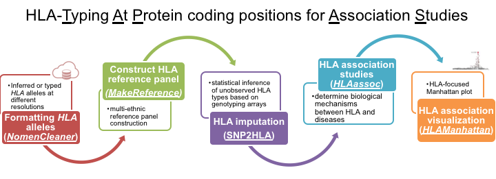

# HLA-TAPAS
**HLA-TAPAS** (HLA-Typing At Protein for Association Studies) is an HLA-focused pipeline that can handle HLA reference panel construction (*MakeReference*), HLA imputation (*SNP2HLA*), and HLA association (*HLAassoc*).

Briefly, major updates include 

(1) using PLINK-v1.9 instead of v1.07; 

(2) using BEAGLE v4.1 instead of v3 for phasing and imputation; and 

(3) including custom R scripts for performing association and fine-mapping analysis in multiple ancestries. 



## Citation
Please cite [the following paper](https://www.nature.com/articles/s41588-021-00935-7) if you choose to use this work.

Luo, Y., Kanai, M., Choi, W. et al. A high-resolution HLA reference panel capturing global population diversity enables multi-ancestry fine-mapping in HIV host response. Nat Genet 53, 1504–1516 (2021). https://doi.org/10.1038/s41588-021-00935-7


## Requirments & Dependencies

Linux or OS_X environment is required for HLA-TAPAS. HLA-TAPAS currently doesn't support Windows.

Python system requires next settings.
- python=3.7.x
- pandas=1.0.3

R statistical programming language requires next settings.
- R=3.6.x
- argparse
- stringr
- purrr
- dplyr
- multidplyr
- tidyr
- data.table
- parallel
- rcompanion

Next, the following external softwares need to be prepared in 'dependency/' folder.
- PLINK v1.9b (https://www.cog-genomics.org/plink2)
- BEAGLE v4.1 (https://faculty.washington.edu/browning/beagle/b4_1.html#download)
- beagle2vcf.jar (https://faculty.washington.edu/browning/beagle_utilities/utilities.html)
- linkage2beagle.jar (https://faculty.washington.edu/browning/beagle_utilities/utilities.html)
- vcf2beagle.jar (https://faculty.washington.edu/browning/beagle_utilities/utilities.html)

Related to BEAGLE v4.1, after downloading and preparing it in 'dependency/' folder, **RENAME IT TO 'beagle.jar'**.

(Sorry Users! You need to download them yourselves due to copyright issue.)

Then, change the file permission of PLINK.
```
$ chmod +x dependency/plink
```

<br>
<br>


## Usage example

Main usage example of HLA-TAPAS is as below.

```
$ python HLA-TAPAS.py \
    --target example/Case+Control.300+300.chr6.hg18 \
    --reference example/1000G.EUR.chr6.hg18.28mb-35mb \
    --hped-Ggroup example/1000G.EUR.Ggroup.hped \
    --pheno example/Case+Control.300+300.phe \
    --hg 18 \
    --out MyHLA-TAPAS/Case+Control+1000G_EUR_REF \
#   --mem 4g \
#   --nthreads 4
```
Last two arguments are for Java Heap memory size and the number of threads to be used in Beagle. Users can specify those values on their own.

Each main module (tapa) of HLA-TAPAS can be implemented separately.

### (1) Formatting *HLA* alleles ([NomenCleaner](./NomenCleaner))

Code adapted from HATK: https://github.com/WansonChoi/HATK

**NomenCleaner** transforms a ped file with *HLA* alleles in various form to new ped file of which HLA alleles are in the form which user requests (e.g., "two-field", "G-group").

A HLA PED file contains the *HLA* alleles typed at different resolutions (FID,IID,pID,mID,SEX,PHENO,A,B,C,DPA1,DPB1,DQA1,DQB1,DRB1).

Please refer to the [NomenCleaner](./NomenCleaner) tapa for more details. An example usage is given below:

```
$ python -m NomenCleaner \
    --hped NomenCleaner/example/g1k_subset.ped \
    --out NomenCleaner/example/g1k_subset \
    --4field
```

### (2) Building a reference panel ([MakeReference](./MakeReference))
**MakeReference** builds a reference panel that can be used for HLA imputation. It is an updated version of the [SNP2HLA](http://software.broadinstitute.org/mpg/snp2hla/), that uses BEAGLE v4 instead of v3 for phasing.

A reference panel built by 2,504 individuals from the 1000 Genomes project is avaiable [here](./resources). 

Please refer to the [MakeReference](./MakeReference) tapa for more details. An example usage is given below:
```
$ python -m MakeReference \
    --variants  MakeReference/example/g1k_subset_snps\
    --chped MakeReference/example/g1k_subset.chped \
    --hg 19 \
    --out MakeReference/example/g1k_subset.bglv4 \
    --dict-AA MakeReference/data/hg19/HLA_DICTIONARY_AA.hg19.imgt3320 \
    --dict-SNPS MakeReference/data/hg19/HLA_DICTIONARY_SNPS.hg19.imgt3320 \
    --phasing
```

### (3) HLA imputation ([SNP2HLA](./SNP2HLA))
**SNP2HLA** tapa is for amino acid and SNP imputation in the extend major histocompatibity complext (MHC) region in chromosome 6 (28-35Mb). It is an updated version of the previous [SNP2HLA](http://software.broadinstitute.org/mpg/snp2hla/) that uses BEALGE v4 instead v3 for imputation.

Please refer to the ([SNP2HLA](./SNP2HLA)) tapa for more details. An example usage is given below:

```
$ python -m SNP2HLA \
    --target SNP2HLA/example/1958BC \
    --reference resources/1000G.bglv4 \
    --out MySNP2HLA/IMPUTED.1958BC \
    --nthreads 2 \
    --mem 4g
```

### (4) HLA associaiton and fine-mapping studies ([HLAassoc](./HLAassoc))
**HLAassoc** tapa focuses on performing HLA-focused association test using output after performing HLA imputation (using [SNP2HLA](./SNP2HLA) or other softwares). It consists of two types of association - **single marker** based association test to perform either a **(4-1)** LOGISITIC or a  **(4-2)** LINEAR regression using the [PLINK](https://www.cog-genomics.org/plink/1.9/assoc); and **(4-3)** a joint **haplotype-based** association analysis at the amino acid level.

Please refer the the ([HLAassoc](./HLAassoc)) tapa for more details. Examples are given below:

#### (4-1) Logistic regression
```
python -m HLAassoc LOGISTIC \
    --vcf HLAassoc/example/IMPUTED.1958BC.bgl.phased.vcf.gz \
    --out Myassoc/IMPUTED.1958BC.rev_map \
    --pheno HLAassoc/example/1958BC.phe \
    --pheno-name p1 \
    --hped HLAassoc/example/1958BC.Ggroup.hped \
    --chped HLAassoc/example/1958BC.imgt3320.4field.chped
```

#### (4-2) Linear regression
```
python -m HLAassoc LINEAR \
    --vcf HLAassoc/example/IMPUTED.1958BC.bgl.phased.vcf.gz \
    --out Myassoc/IMPUTED.1958BC.rev_map \
    --pheno HLAassoc/example/1958BC.phe \
    --pheno-name p2 \
    --hped HLAassoc/example/1958BC.Ggroup.hped \
    --chped HLAassoc/example/1958BC.imgt3320.4field.chped
```

#### (4-3) Omnibus test
```
$ python -m HLAassoc OMNIBUS \
    --file HLAassoc/example/OMNIBUS/Case+Control+1000G_EUR_REF.IMPUTED.chr6.hg18.100+100 \
    --pop HLAassoc/example/OMNIBUS/Case+Control+1000G_EUR_REF.IMPUTED.chr6.hg18.100+100.pop \
    --out Myassoc/Case+Control+1000G_EUR_REF.OMNIBUS \
    --aa-only \
    --maf-threshold 0
```

### (5) Plot (step-wise) association results ([HLAManhattan](./HLAManhattan))
This tapa plots reuslts from the single-marker  HLA fine-mapping studies
```
$ python -m HLAManhattan \
    --assoc-result HLAManhattan/example/1958BC+HM_CEU_REF.IMPUTED.assoc.logistic \
    --hg 18 \
    --out MyManhattan/1958BC+HM_CEU_REF.IMPUTED
```

<br>
<br>

# Support
Before contacting us or leaving an issue, please try the following:

1. Each tapa has its own working examples ([`NomenCleaner`](https://github.com/immunogenomics/HLA-TAPAS/tree/master/NomenCleaner); [`MakeReference`](https://github.com/immunogenomics/HLA-TAPAS/tree/master/MakeReference);[`SNP2HLA`](https://github.com/immunogenomics/HLA-TAPAS/tree/master/SNP2HLA); and [`HLAassoc`](https://github.com/immunogenomics/HLA-TAPAS/tree/master/HLAassoc)).
2. Common issues and questions are descirbed in the wiki [FAQ](https://github.com/immunogenomics/HLA-TAPAS/wiki/HLA-TAPAS-FAQ).
3. The methods and applicationsare described in the paper (citation below).

If you still have questions, please leave an [issue](https://github.com/immunogenomics/HLA-TAPAS/issues), or contact us at snp2hla AT broadinstitute DOT org

<!-- 
## Development Log

(2020.04.30.) 

[MakeReference_v2]
    
- refined dependency checkings.
- introduced two tricks, (1) ATtrick and (2) redefineBP, to make Beagle framework work with binary markers.
- File conversion from PLINK to VCF format in 'PREPARE' code block.
- Phasing with Beagle 4.1 is now available.


[SNP2HLA]
- modified the way to convert target PLINK SNP data to VCF file.
- modified bash command for imputation and its execution way(os.system() -> subprocess.run()).

[NomenCleaner]
- disjointly integrated NomenCleaner as a package.
- Upgraded parts have been applied.


(2020.05.01)

[HLA_assoc]
- introduced reverse-mapping module which Yang requested in the recent mail(2020.04.26 00:22).
- introduced PLINK logistic regression for association test.

(2020.05.02.)

[HLA-TAPAS]
- All (1) NomenCleaner, (2) MakeReference(v2, Beagle4.1), (3) SNP2HLA(Python version, Beagle4.1) and (4) HLA_assoc have been integrated in 'HLA-TAPAS.py' main pipeline.
- succeeded in the 1st whole implementations of those functions with 'example/' data.
 -->
